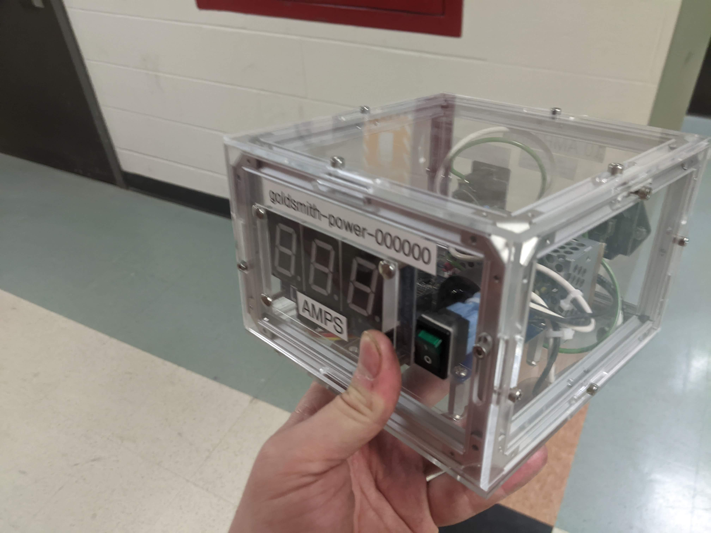

# MQTT power sensor

Simple project for measuring AC current using MQTT.

Designed to work with [mqtt.chem.wisc.edu](https://mqtt.chem.wisc.edu/).

## Repository

This is an open source hardware project licensed under the CERN Open Hardware Licence Version 2 - Permissive.
Please see the LICENSE file for the complete license.

## Bill of Materials

| part | manufacturer | part number | price |
| ---- | ------------ | ----------- | ----- |
| ESP8266 IoT Communication Module with Integrated USB | NCD | PR32-26 | $13.95 |
| AS1115 34mm 3-Character Red 7-Segment Hexidecimal Display with I2C Interface | NCD | PR33-11 | $47.95 |
| 1-Channel On-Board 97% Accuracy 70-Amp AC Current Monitor with IoT Interface | NCD | PR18-2_20A | $59.95 |

All prices are extended.

## Firmware

This project uses [micropython](https://micropython.org/), specifically [microhomie](https://github.com/microhomie/microhomie).
Refer to the "firmware" directory in this repository for detailed instructions.
